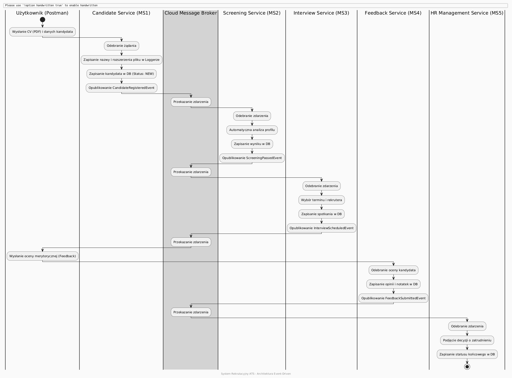

# Recruitment System

This project is a microservice-based recruitment workflow built with Spring Boot. It implements a selected business process in the recruitment domain and follows the required architectural constraints: clean architecture in every service, message-based communication through RabbitMQ, database per service, logging in each service, and a file upload step handled by the candidate service.

## Project Description

The implemented process covers the recruitment flow from candidate registration to the final HR decision.

The process starts when a candidate submits a CV file together with personal data. The Candidate Service receives the file, logs its name and extension, stores candidate data, and publishes an event to the message broker. The Screening Service consumes that event, performs automated screening, and publishes the result. The Interview Service receives the screening result and schedules an interview. After the interview, the Feedback Service stores recruiter feedback and publishes another event. Finally, the HR Service consumes the feedback event and stores the final hiring decision.

The system uses:
- Spring Boot
- PostgreSQL running in Docker
- RabbitMQ hosted in CloudAMQP
- Mediator pattern
- CQS, where commands change state and queries read data

## Architecture

Each microservice is structured according to clean architecture. The code is separated into layers such as:
- API layer
- Application layer
- Domain layer
- Infrastructure layer

Communication between the API layer and use cases is handled through a mediator. This keeps controllers and message listeners thin and decoupled from the business logic.

## Microservices

### Candidate Service
Responsible for candidate registration and CV upload.

Main responsibilities:
- Accepts multipart file uploads
- Extracts and logs the file name and extension
- Stores candidate data and file metadata in its own database
- Publishes the CandidateRegisteredEvent

REST endpoints:
- POST /api/candidates
- GET /api/candidates/{id}

### Screening Service
Responsible for automatic CV screening.

Main responsibilities:
- Consumes CandidateRegisteredEvent from RabbitMQ
- Performs automated screening
- Stores screening result in its own database
- Publishes ScreeningPassedEvent

This service is event-driven and does not expose a public REST endpoint in the current implementation.

### Interview Service
Responsible for interview scheduling.

Main responsibilities:
- Consumes ScreeningPassedEvent from RabbitMQ
- Chooses a recruiter and interview date
- Stores the interview in its own database
- Publishes InterviewScheduledEvent

REST endpoints:
- GET /api/interviews/{id}

### Feedback Service
Responsible for collecting interview feedback.

Main responsibilities:
- Accepts feedback from the user
- Stores feedback in its own database
- Publishes FeedbackSubmittedEvent

REST endpoints:
- POST /api/feedbacks
- GET /api/feedbacks/{id}

### HR Service
Responsible for the final hiring decision.

Main responsibilities:
- Consumes FeedbackSubmittedEvent from RabbitMQ
- Maps feedback to a final hiring decision
- Stores the HR decision in its own database

REST endpoints:
- GET /api/hr-decisions/{id}

## Database Per Service

Each microservice has its own PostgreSQL database:
- CandidateDB
- ScreeningDB
- InterviewDB
- FeedbackDB
- HrDB

The PostgreSQL container is started with Docker, and the remaining databases are created through init-db/init.sql.

## Message Broker

The services communicate asynchronously using RabbitMQ hosted in CloudAMQP. The broker is configured with SSL and used as the central integration mechanism between services.

## Logging

Every microservice uses logging and records information about called methods and important business actions. The logs include:
- incoming requests
- command handling
- event publishing
- event consumption
- saved entities and decisions

## How to Run

Requirements:
- Java 21
- Docker
- Maven
- Internet access to CloudAMQP

Run PostgreSQL with Docker first, then start the microservices separately. Each service can be started from its own directory using Maven or directly from the IDE.

Suggested order:
1. Start the database container
2. Start Candidate Service
3. Start Screening Service
4. Start Interview Service
5. Start Feedback Service
6. Start HR Service

## Postman Tests

The system should be tested in Postman. Minimum recommended requests:
- Register a candidate with CV upload
- Get candidate by ID
- Submit feedback for an interview
- Get feedback by ID
- Get interview by ID
- Get HR decision by ID

Example test flow:
1. Send a multipart form-data request to register a candidate.
2. Use the returned candidate ID in a GET request.
3. Submit feedback and verify the next steps in the workflow.

## Notes

- The uploaded CV is not processed at this stage.
- Only the file name and extension are logged, as required by the assignment.
- The BPMN diagram is stored in the file bpnm.png in the same directory as this README.